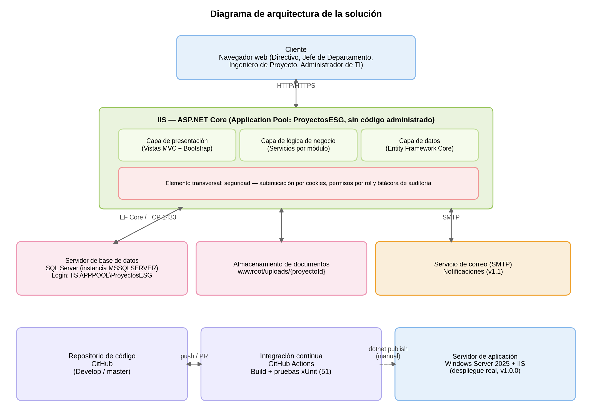

# Sistema de Control de Proyectos – ESG

> Proyecto integrador de la materia **Productividad Basada en Herramientas Tecnológicas**
> Universidad TecMilenio · Emely Braham Padilla · Matrícula 05089583

[](https://github.com/emelybp/ProyectosESG/actions)

---

## Tabla de contenidos

- [Resumen ejecutivo](#resumen-ejecutivo)
  - [Descripción](#descripción)
  - [Problema identificado](#problema-identificado)
  - [Solución](#solución)
  - [Arquitectura](#arquitectura)
- [Requerimientos](#requerimientos)
- [Instalación](#instalación)
- [Configuración](#configuración)
- [Uso](#uso)
  - [Usuarios de prueba](#usuarios-de-prueba)
  - [Usuario final](#usuario-final)
  - [Usuario administrador](#usuario-administrador)
- [Contribución](#contribución)
- [Roadmap](#roadmap)
- [Licencia y contacto](#licencia-y-contacto)

> Documentación extendida (manuales con capturas pantalla por pantalla) en la
> [**Wiki del repositorio**](https://github.com/emelybp/ProyectosESG/wiki).

---

## Resumen ejecutivo

### Descripción

El **Sistema de Control de Proyectos – ESG** es una aplicación web que centraliza la
administración de los proyectos de Equipos y Sistemas de Generación, empresa dedicada a la
consultoría e ingeniería de sistemas de generación de energía. Centraliza el expediente
digital de cada proyecto: sus documentos, sus costos e ingresos, sus tareas y los reportes
de avance. Está pensado para cuatro perfiles de usuario: **directivos**, **jefes de
departamento**, **ingenieros de proyecto** y el **administrador de TI**, que da
mantenimiento al sistema.

### Problema identificado

Antes del sistema, la información de los proyectos vivía repartida entre carpetas
compartidas, correos y hojas de cálculo. Eso provocaba cuatro problemas concretos:

1. No se sabía cuál era la versión vigente de un documento, ni había forma de separar
   varios documentos del mismo tipo (por ejemplo, varias cotizaciones de un proyecto).
2. No había avisos cuando un permiso o contrato estaba por vencer.
3. Los reportes de costos e ingresos se armaban a mano y llegaban tarde.
4. Cualquiera con acceso a la carpeta podía ver o modificar información sensible, sin
   distinción de roles.

### Solución

Una aplicación web con acceso por rol que resuelve esos cuatro puntos:

| Necesidad | Cómo la resuelve el sistema |
|---|---|
| Información dispersa | Expediente único por proyecto, con filtro de documentos por tipo (RF-01 a RF-04, RE-03) |
| Control financiero | Registro de costos e ingresos con folio fiscal (RF-05, RF-06, RE-01) |
| Seguimiento del trabajo | Tareas e hitos con porcentaje de avance (RF-07, RF-08) |
| Visibilidad para dirección | Reportes de avance y resumen financiero (RF-09, RF-10, RF-13, RF-14) |
| Seguridad | Autenticación, permisos por rol y bitácora de auditoría (RF-11, RF-12) |
| Administración | Alta de usuarios, bitácora y mantenimiento de documentos, exclusivo para TI |

### Arquitectura



| Componente | Descripción |
|---|---|
| Cliente | Navegador web de directivos, jefes de departamento, ingenieros de proyecto y TI |
| Servidor web / de aplicación | IIS + ASP.NET Core, en tres capas: presentación, lógica de negocio y datos |
| Seguridad (transversal) | Autenticación por cookies, permisos por rol y bitácora de auditoría |
| Base de datos | SQL Server (autenticación de Windows) |
| Almacenamiento de documentos | Carpeta `wwwroot/uploads/{proyectoId}` en el servidor |
| Servicio de correo | SMTP para notificaciones automáticas (planeado para v1.1) |
| Integración continua | GitHub Actions: compilación y 51 pruebas xUnit en cada push y pull request |

---

## Requerimientos

### Servidores

| Elemento | Versión usada en este proyecto |
|---|---|
| Servidor de aplicación / web | IIS en Windows Server 2025 |
| Servidor de base de datos | SQL Server (instancia por defecto, autenticación de Windows) |
| Sistema operativo | Windows Server 2025 |

### Plataforma

> **Nota:** el instructivo de la materia pide indicar la versión de Java. Este proyecto
> está construido sobre **.NET**, por lo que se documenta el equivalente directo.

| Elemento | Versión |
|---|---|
| SDK de .NET | **8.0 (LTS)** — instalado junto con el SDK 10 que trae el servidor por defecto; ambos conviven sin problema |
| ASP.NET Core Hosting Bundle | 8.0 (necesario para que IIS pueda hospedar la aplicación) |
| Entity Framework Core | 8.0 |
| Git | 2.54 o superior |

### Paquetes adicionales (NuGet)

- `Microsoft.EntityFrameworkCore.SqlServer`
- `Microsoft.EntityFrameworkCore.Design`
- `Microsoft.AspNetCore.Identity.EntityFrameworkCore`
- `Microsoft.NET.Test.Sdk`
- `xunit`
- `xunit.runner.visualstudio`

---

## Instalación

### 1. Instalar el ambiente (Windows Server o de desarrollo)

```powershell
# Requisitos previos: .NET 8 SDK, SQL Server y Git instalados
# En Windows, con winget:
winget install --id Microsoft.DotNet.SDK.8 --exact
winget install --id Microsoft.DotNet.HostingBundle.8 --exact
winget install --id Git.Git --exact

git clone https://github.com/emelybp/ProyectosESG.git
cd ProyectosESG/src/SistemaControlProyectos

# Restaurar dependencias
dotnet restore
```

### 2. Configurar la cadena de conexión

Copia el valor de ejemplo de `appsettings.json` y ajusta `DefaultConnection` con el nombre
real de tu instancia de SQL Server (ver sección [Configuración](#configuración)).

### 3. Levantar la aplicación

```powershell
dotnet build
dotnet run
```

La base de datos, sus tablas y los datos de ejemplo (roles, 4 usuarios de prueba y un
cliente) se crean **automáticamente la primera vez que arranca la aplicación** — no hace
falta correr `dotnet ef database update` por separado, el propio `Program.cs` aplica las
migraciones al iniciar. La aplicación queda disponible en `http://localhost:5000`.

### 4. Ejecutar las pruebas manualmente

```powershell
dotnet test
```

Este es el mismo comando que ejecuta de forma automática el workflow de integración
continua en cada push a `Develop` o `master`.

### 5. Publicar para producción

```powershell
dotnet publish -c Release -o ./publish
```

### 6. Instalar en IIS

1. Crear un Application Pool con **.NET CLR: "Sin código administrado"** (obligatorio,
   ASP.NET Core no usa el pipeline clásico de IIS).
2. Copiar el contenido de `./publish` a la carpeta del sitio (por ejemplo,
   `C:\inetpub\ProyectosESG`).
3. Crear el sitio en IIS apuntando a esa carpeta y ese Application Pool.
4. Dar permisos de lectura a `IIS_IUSRS` sobre la carpeta del sitio, y de escritura sobre
   `wwwroot/uploads` (ahí se guardan los documentos cargados desde el sistema).
5. **Paso que es fácil pasar por alto:** si la cadena de conexión usa autenticación de
   Windows (`Trusted_Connection=True`), el Application Pool corre con una identidad
   distinta a la tuya y no va a poder conectarse a la base de datos hasta que le des
   permiso explícito:
   ```sql
   CREATE LOGIN [IIS APPPOOL\NombreDeTuAppPool] FROM WINDOWS;
   USE ProyectosESG;
   CREATE USER [IIS APPPOOL\NombreDeTuAppPool] FOR LOGIN [IIS APPPOOL\NombreDeTuAppPool];
   ALTER ROLE db_owner ADD MEMBER [IIS APPPOOL\NombreDeTuAppPool];
   ```
   Esta cuenta virtual solo existe para Windows después de que el Application Pool arrancó
   al menos una vez — si el script anterior dice que no encuentra el usuario, visita el
   sitio una vez primero (aunque marque error) y vuelve a intentar.

> **Sobre el despliegue en la nube:** Heroku no da soporte oficial a aplicaciones .NET y su
> capa gratuita fue retirada, por lo que el despliegue de este proyecto se realizó en un
> servidor Windows Server 2025 con IIS proporcionado para pruebas. El paquete listo para
> ejecutar también se publica en la sección
> [Releases](https://github.com/emelybp/ProyectosESG/releases).

---

## Configuración

### Configuración del producto

Archivo `appsettings.json` (valores de ejemplo, sin datos reales):

```json
{
  "ConnectionStrings": {
    "DefaultConnection": "Server=localhost;Database=ProyectosESG;Trusted_Connection=True;TrustServerCertificate=True"
  },
  "Smtp": {
    "Host": "smtp.empresa.com",
    "Port": 587,
    "Usuario": "notificaciones@empresa.com",
    "UsarTls": true
  },
  "Almacenamiento": {
    "RutaDocumentos": "wwwroot/uploads"
  },
  "Notificaciones": {
    "DiasAnticipacionVencimiento": 30
  }
}
```

> Las contraseñas reales **no se guardan en el repositorio**. La cadena de conexión de
> ejemplo usa autenticación de Windows (sin contraseña); en un ambiente con SQL Server
> Authentication, la contraseña se manejaría con *user secrets* de .NET en desarrollo y
> variables de entorno en producción.

### Otros archivos de configuración

| Archivo | Para qué sirve |
|---|---|
| `appsettings.Development.json` | Valores propios del equipo de desarrollo |
| `.github/workflows/ci.yml` | Integración continua: cuándo corre, versión del SDK, build y pruebas |
| `.gitignore` | Archivos que no se suben al repositorio (binarios, secretos, `bin/`, `obj/`) |
| `Migrations/` | Migración de Entity Framework Core con la estructura completa de la base de datos |

---

## Uso

### Usuarios de prueba

Al arrancar por primera vez, el sistema carga automáticamente 4 usuarios de ejemplo (uno
por rol) y un cliente de ejemplo, para poder probar el sistema sin captura manual:

| Correo | Contraseña | Rol |
|---|---|---|
| directivo@esgsa.com.mx | Directivo#2026 | Directivo |
| jefeproyectos@esgsa.com.mx | JefeDpto#2026 | Jefe de Departamento |
| ingeniero@esgsa.com.mx | Ingeniero#2026 | Ingeniero de Proyecto |
| ti@esgsa.com.mx | AdminTI#2026 | Administrador de TI |

### Usuario final

Manual dirigido a directivos, jefes de departamento e ingenieros de proyecto.

| Tarea | Ruta en el sistema | Requerimiento |
|---|---|---|
| Iniciar sesión | `/Account/Login` | RF-11 |
| Listado de proyectos | `/Proyectos` | RF-10 |
| Registrar un proyecto | `/Proyectos/Create` | RF-01 |
| Ver el detalle de un proyecto (punto de entrada a sus módulos) | `/Proyectos/Detalle/{id}` | — |
| Editar un proyecto y cambiar su estatus | `/Proyectos/Edit/{id}` | RF-02 |
| Dar de alta un cliente | `/Clientes/Create` | — |
| Cargar y filtrar documentos por tipo | `/Documentos?proyectoId={id}` | RF-03, RF-04, RE-03 |
| Registrar un costo o un ingreso | `/CostosIngresos?proyectoId={id}` | RF-05, RF-06, RE-01 |
| Registrar y actualizar el avance de una tarea | `/Tareas?proyectoId={id}` | RF-07, RF-08 |
| Consultar el reporte de avance | `/Reportes/Avance?proyectoId={id}` | RF-13 |
| Consultar la documentación faltante | `/Reportes/DocumentacionFaltante?proyectoId={id}` | RF-14 |

El menú de navegación superior muestra únicamente los módulos a los que el rol del usuario
tiene acceso (RF-12).

Cada tarea está explicada paso a paso y con capturas en la
[Wiki → Manual de usuario final](https://github.com/emelybp/ProyectosESG/wiki).

### Usuario administrador

Manual dirigido al Administrador de TI, quien al iniciar sesión entra directo a este
módulo (no opera proyectos).

| Tarea | Ruta en el sistema |
|---|---|
| Consultar y dar de alta usuarios | `/Administracion/Usuarios`, `/Administracion/CrearUsuario` |
| Consultar la bitácora de auditoría | `/Administracion/Bitacora` |
| Mantenimiento de documentos (consulta y eliminación entre todos los proyectos) | `/Administracion/Documentos` |

Detalle completo en la
[Wiki → Manual de administrador](https://github.com/emelybp/ProyectosESG/wiki).

---

## Contribución

La guía completa está en [CONTRIBUTING.md](CONTRIBUTING.md). En resumen:

```powershell
# 1. Clonar el repositorio
git clone https://github.com/emelybp/ProyectosESG.git
cd ProyectosESG

# 2. Partir siempre de Develop
git checkout Develop
git pull origin Develop

# 3. Crear una rama por tarea
git checkout -b feature/RF-05-registrar-costo

# 4. Trabajar y confirmar los cambios
git add .
git commit -m "RF-05: registro de costos por proyecto"

# 5. Subir la rama
git push origin feature/RF-05-registrar-costo
```

6. Abrir el **pull request** hacia `Develop` y escribir en la descripción `Closes #NN`
   para vincular el issue.
7. Esperar a que el workflow de CI termine en verde.
8. Hacer el **merge** y confirmar que el issue se cerró. Borrar la rama de tarea.

**Ramas del proyecto:** `master` (versión liberada) y `Develop` (integración), más una
rama `feature/…` por cada tarea.

---

## Roadmap

Requerimientos que no entran en la versión 1. Los que ya están registrados como
issues en el repositorio (etiqueta `fuera-de-v1`) son los más urgentes; los
demás son visión a más largo plazo, planeados por versión.

### Próximas prioridades (ya registradas como issues)

| Issue | Requerimiento futuro |
|---|---|
| #20 | Portal de consulta para clientes externos |
| #21 | Integración con facturación electrónica |
| #22 | Firma electrónica de documentos |
| #23 | Reportes financieros avanzados (flujo de caja y rentabilidad) |
| #NN | CRUD completo (editar y eliminar) en Documentos, Costos/Ingresos y Plan de Trabajo |

Ver todos los issues con la etiqueta [`fuera-de-v1`](https://github.com/emelybp/ProyectosESG/issues?q=is%3Aissue+label%3Afuera-de-v1).

### Visión a más largo plazo

| Versión | Requerimiento futuro |
|---|---|
| v1.1 | Notificaciones automáticas por correo (SMTP) de documentos y tareas por vencer |
| v1.1 | Panel de indicadores con gráficas de avance y rentabilidad |
| v1.2 | Aplicación móvil para captura de avance en campo |
| v1.3 | Integración con facturación electrónica para validar folios fiscales |
| v2.0 | Firma electrónica de documentos |
| v2.0 | Portal de consulta de solo lectura para clientes externos |
| v2.0 | API pública para conectarse con el sistema contable |

---

## Licencia y contacto

Proyecto académico sin fines comerciales, desarrollado para la Universidad TecMilenio.

**Autora:** Emely Braham Padilla — [@emelybp](https://github.com/emelybp)
**Profesor:** Jesús Cazares Martínez
